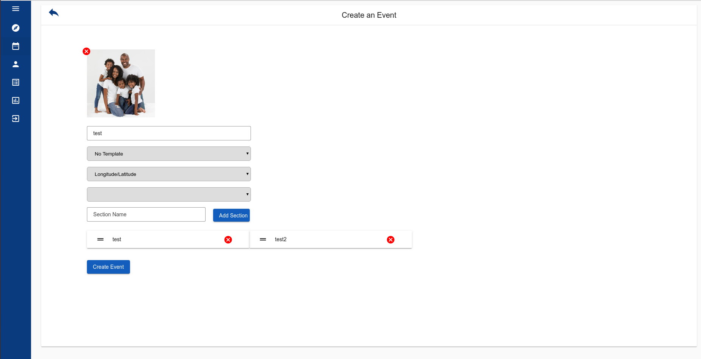
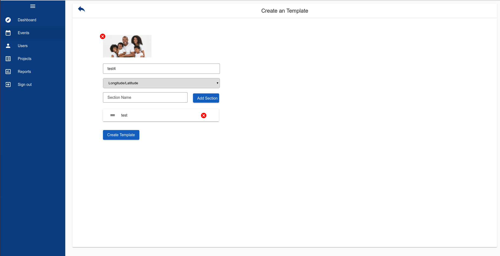
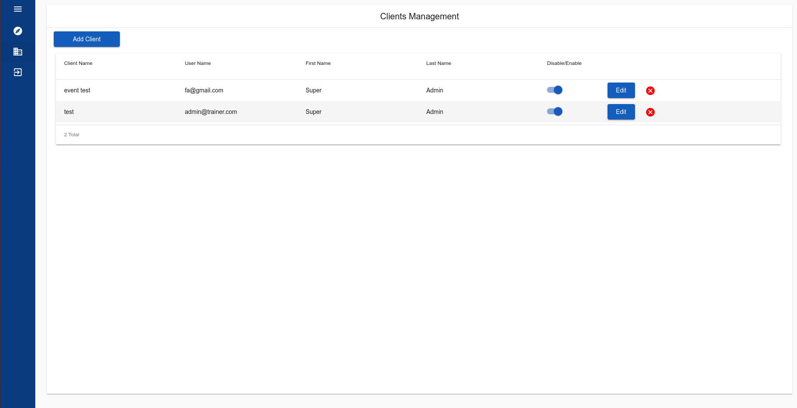
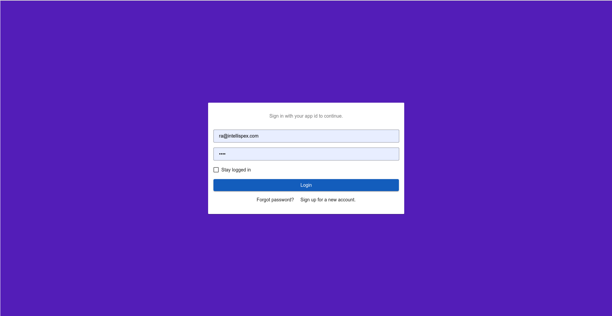

# Intelli Spex Project

## this is an admin panel for an insurance company.

## users could take pics from an event and share it and the others could add comments and make posts on that event .
## they could argue about the reasons of that event.

### How to start

#screenshots









**Note** that this seed project requires **node >=v8.9.0 and npm >=4**.

In order to start the project use:

```bash
$ yarn install
# watches your files and uses livereload by default run `npm start` for a dev server. Navigate to `http://localhost:4200/`. The app will automatically reload if you change any of the source files.
$ yarn start
# prod build, will output the production application in `dist`
# the produced code can be deployed (rsynced) to a remote server
$ yarn build
```
# Intelli-Spex

### Code scaffolding

Run `ng generate component component-name` to generate a new component. You can also use `ng generate directive/pipe/service/class/module`.

### Running unit tests

Run `ng test` to execute the unit tests via [Karma](https://karma-runner.github.io).<br>
Run `npm run test-prod` to execute unit test on CI/CD.

### Running end-to-end tests
Active your `vpn` for the first e2e test run to get some data.<br>
Run `ng e2e` to execute the end-to-end tests via [Protractor](http://www.protractortest.org/).
Before running the tests make sure you are serving the app via `ng serve`.

### Further help

To get more help on the Angular CLI use `ng help` or go check out the [Angular CLI README](https://github.com/angular/angular-cli/blob/master/README.md).

### Generate Documentation

Run `doc` task to generate compodoc documentation

### Run Server on dist folder
`yarn global add live-server`
<br>
`live-server --port=9101 --entry-file=./index.html`
